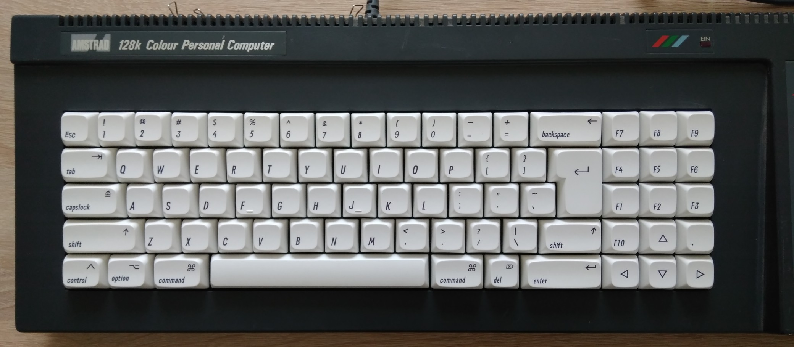

# KCC plus - keyboard assembly

This is a mechanical keyboard for the KCC plus.
It uses a CPC 6128 compatible form factor and keyboard matrix.

# Layout

The following layout is recommended for contemporary English.
Suitable off-the-shelf keycap sets are available.

| Switch    | Glyph     | Switch    | Glyph
|:----------|:----------|:----------|:----------
| SW1       | Esc       | SW39      | F
| SW2       | 1         | SW40      | G
| SW3       | 2         | SW41      | H
| SW4       | 3         | SW42      | J
| SW5       | 4         | SW43      | K
| SW6       | 5         | SW44      | L
| SW7       | 6         | SW45      | ;
| SW8       | 7         | SW46      | '
| SW9       | 8         | SW47      | '
| SW10      | 9         | SW48      | F1
| SW11      | 0         | SW49      | F2
| SW12      | -         | SW50      | F3
| SW13      | =         | SW51      | shift
| SW14      | backspace | SW52      | Z
| SW15      | F7        | SW53      | X
| SW16      | F8        | SW54      | C
| SW17      | F9        | SW55      | V
| SW18      | tab       | SW56      | B
| SW19      | Q         | SW57      | N
| SW20      | W         | SW58      | M
| SW21      | E         | SW59      | ,
| SW22      | R         | SW60      | .
| SW23      | T         | SW61      | /
| SW24      | Y         | SW62      | \
| SW25      | U         | SW63      | shift
| SW26      | I         | SW64      | F10
| SW27      | O         | SW65      | ↑ (up)
| SW28      | P         | SW66      | .
| SW29      | [         | SW67      | control
| SW30      | ]         | SW68      | option
| SW31      | return    | SW69      | command
| SW32      | F4        | SW70      | space
| SW33      | F5        | SW71      | command
| SW34      | F6        | SW72      | del
| SW35      | capslock  | SW73      | enter
| SW36      | A         | SW74      | ← (left)
| SW37      | S         | SW75      | ↓ (down)
| SW38      | D         | SW76      | → (right)

## Pictures

